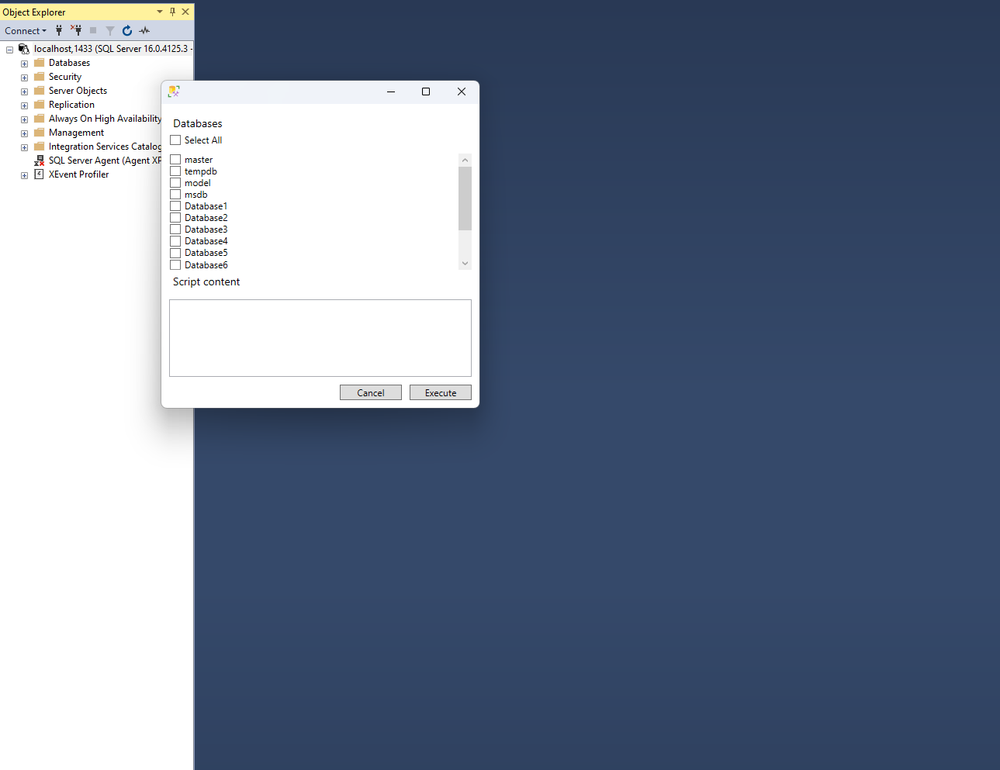

# SSMS-Tools
Set of tools to improve my own experience using SSMS

## Requirements
- SQL Server Management Studio 20

## Tools
- Multi Db Query runner

Generates a query to be executed in the selected databases of the server

# Setup
- Download the latest VSIX file
- Go to your install path and its `Extensions` subfolder (for example: `C:\Program Files (x86)\Microsoft SQL Server Management Studio 20\Common7\IDE\Extensions`)
- Create a `SSMSTools` folder
- Paste the vsix file

## Development
### Requirements
- Visual Studio 2017 (SSMS things, we can't use a newer version)

### Setup
Inside the solution, you need to change two paths:
- Debug -> External program being started
- VSIX -> VSIX content copy path

Both have paths that, although common, might differ from your local development

## TODO
- Unit test project
- Improve UI / UX
- Pipeline
- In-Memory multi db runner command to display the result

## License
MIT